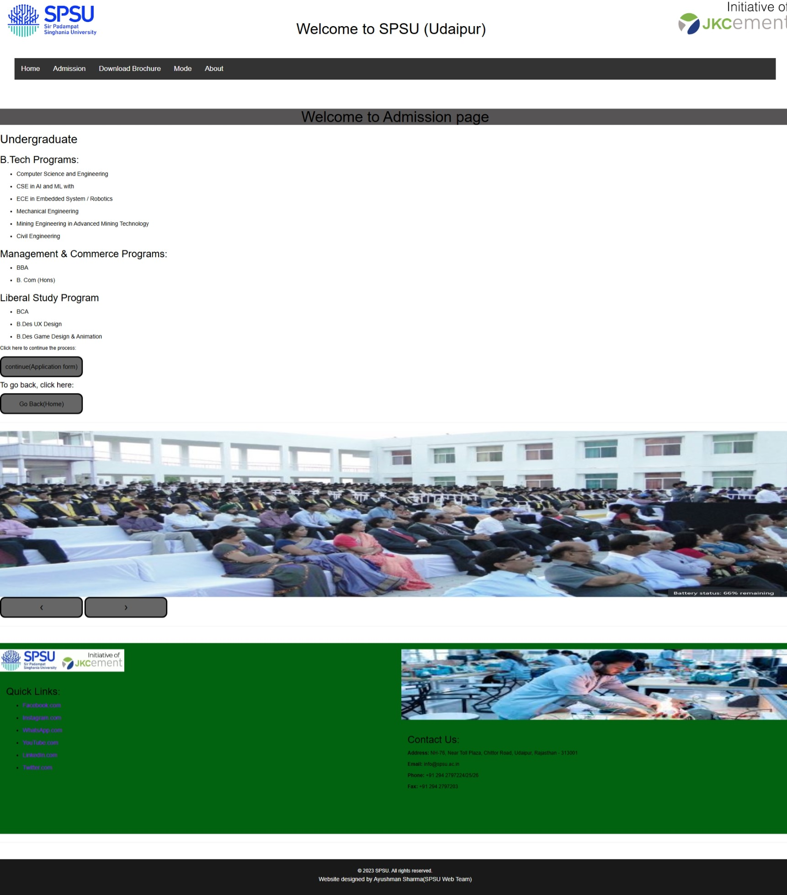
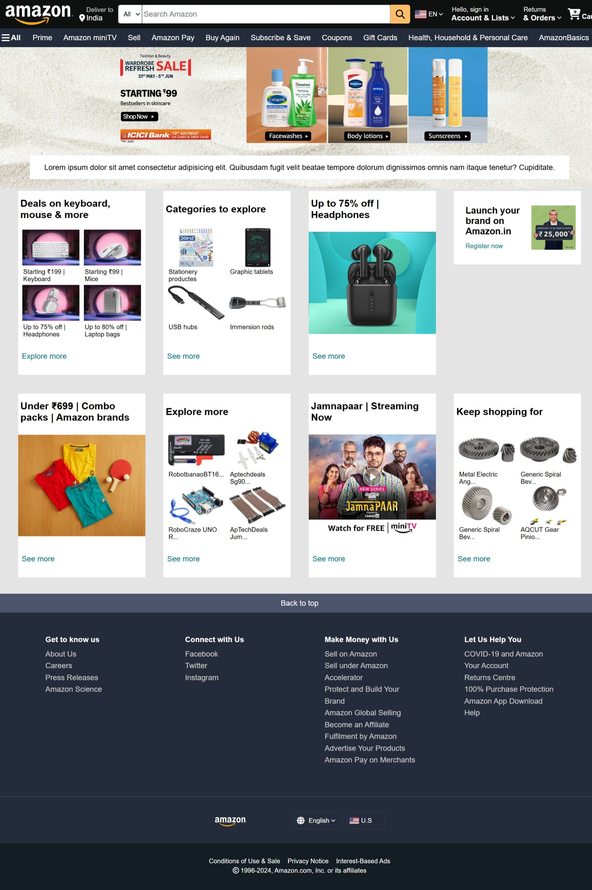
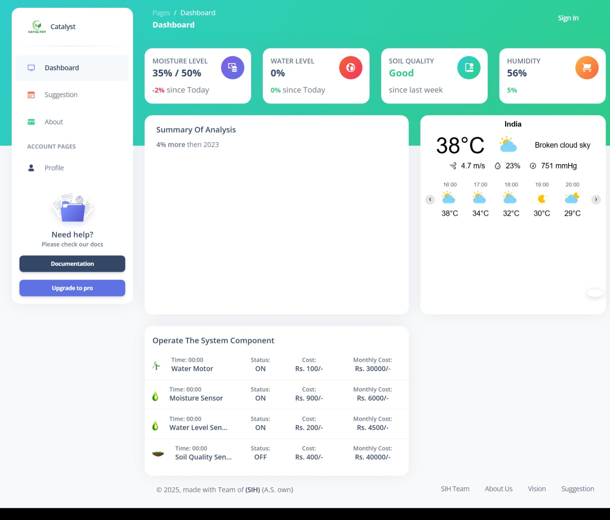

🌐 My Web Projects Portfolio

Welcome! Here's a collection of all my web development projects.

📦 Project 1: College-Admission-Website
**Description**: A simple, responsive website for college admissions. It allows students to explore courses and apply online, with admin access for managing applications and updates.
 
📂 [Repository]

)

---

📦 Project 2: Amazon-Clone-Frontend
**Description**: A frontend replica of the Amazon homepage built using HTML, CSS, and JavaScript. It features a responsive design, product listings, and a basic cart interface for a real e-commerce feel.
 
📂 [Repository]

---

📦 Project 3: IoT-Based-Smart-Farming-Website
**Description**:  A web dashboard that visualizes real-time data from IoT sensors used in smart farming. It displays parameters like soil moisture, temperature, and humidity to help farmers monitor field conditions efficiently.
 
📂 [Repository]

)
